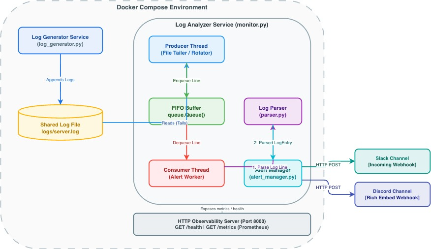
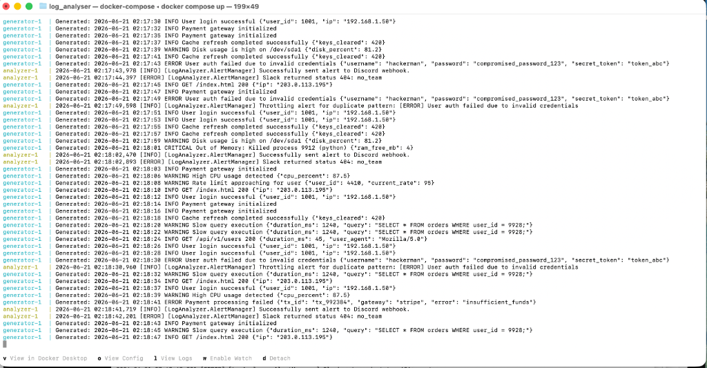
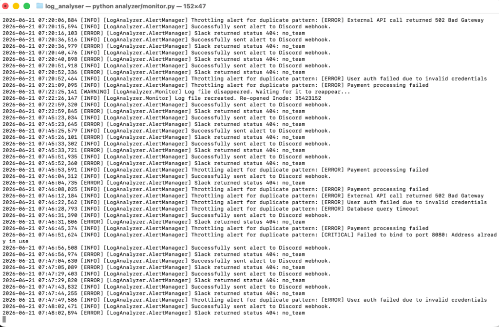
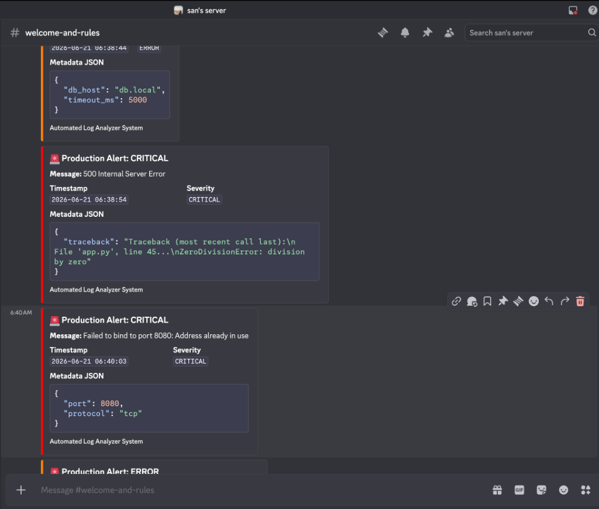
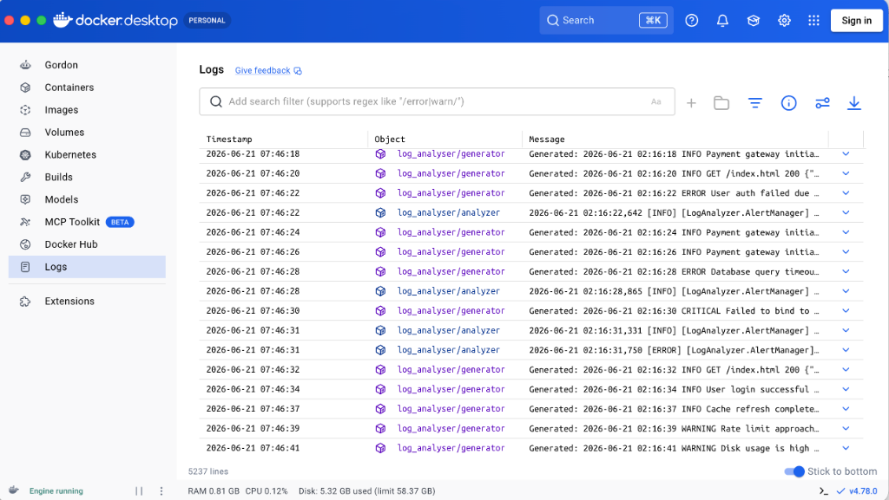
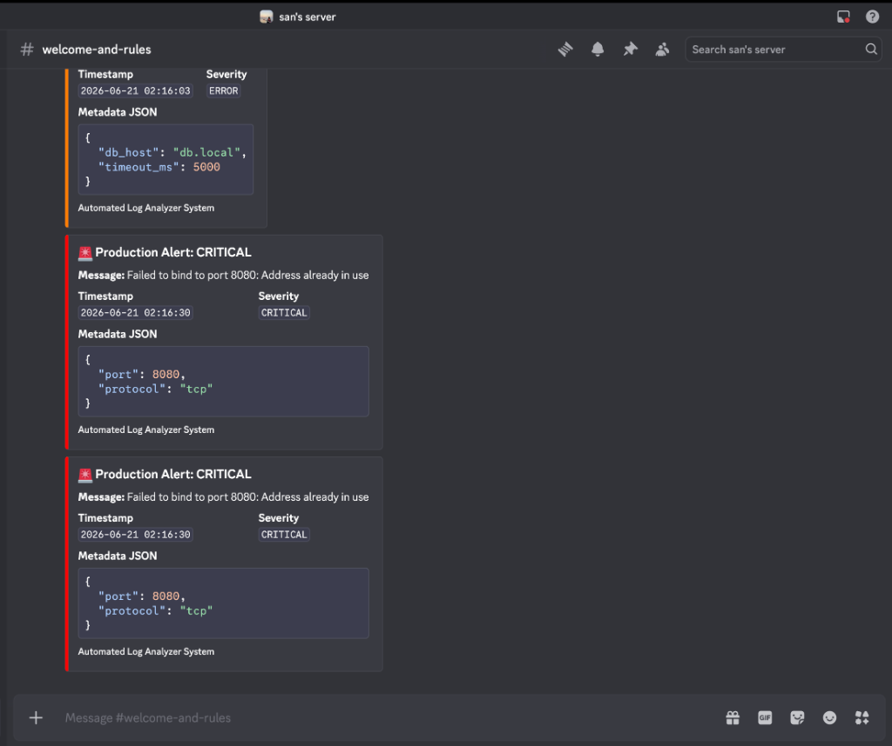

# Automated Production Log Analyzer & Discord/Slack Alerter


An industry-grade, highly resilient DevOps/SRE telemetry agent that tails system log streams, processes events asynchronously via a multi-threaded **Producer-Consumer** architecture, redacts sensitive credentials, and dispatches real-time alerts to Slack and Discord.

---

## 1. Executive Overview

This project simulates a real-world production monitoring, log auditing, and incident alerting system. Designed from an SRE perspective, the application decouples high-performance log ingestion from network-bound alerting APIs using a thread-safe Queue buffer. 

It tails live log files, detects active file system rotations, parses unstructured text into standard objects using regular expressions, dynamically masks sensitive variables (such as tokens or passwords) inside JSON payloads, and dispatches rich alerts. Furthermore, it exposes a built-in HTTP server to serve JSON health states and Prometheus metrics to scraping tools.

---

## 2. Problem Statement

In cloud-scale environments, log telemetry pipelines suffer from four critical operational challenges:
1. **Network Ingestion Stalls**: Synchronous HTTP calls to third-party endpoints (like Discord or Slack Webhooks) block log monitors, leading to file read backpressure and data loss during log floods.
2. **Log Rotation Failures**: Log shippers often crash or lose file handles when log rotation utilities archive, rename, or truncate active logs.
3. **Alert Fatigue**: Incident cascades (e.g., database outages) generate hundreds of identical errors per second, spamming messaging channels and triggering API rate limits.
4. **Credential Leakage**: Modern microservices sometimes log sensitive payload metadata (e.g., passwords or tokens), exposing PII to destination chat channels.

---

## 3. Solution Architecture

The system resolves these issues using a multi-threaded design:
*   **Producer-Consumer Separation**: The main thread (Producer) continuously reads log streams and enqueues lines instantly. A background worker thread (Consumer) dequeues lines, parses them, and manages webhook alerts.
*   **Volatile Queue Protection**: The queue buffers log spikes, ensuring high I/O throughput even if remote notification targets slow down or experience outages.
*   **Observability Thread**: A separate background HTTP thread serves metrics and health states without interfering with the ingestion loop.

---

## 4. Architecture Diagram



*(Refer to the [Screenshots](#screenshots-section) section for the visual Draw.io rendering).* 

---

## Screenshots

### Docker Compose and Logs





### Alerting and Dashboard





> Open the `assets/` folder for the full set of screenshot files captured in this repository.

---

## ✨ 5. Key Features

*   **Continuous Log Tailing**: Simulates `tail -f` behavior with low-overhead file system polling.
*   **Log Rotation Resilience**: Monitors inode mappings and file size to recover from rotation and truncation.
*   **Queue-Based Decoupling**: Thread-safe `queue.Queue` buffers incoming events from the network alerts loop.
*   **Optimized Regex Matching**: Extracts timestamps, log levels, and messages from space-separated formats.
*   **PII & Credential Redaction**: Recursively strips secret tokens, passwords, and keys inside JSON log metadata.
*   **Slack Block Kit Integration**: Formats webhook payloads into visual Slack structural components.
*   **Discord Rich Embeds**: Maps severities to color codes (Red for CRITICAL, Orange for ERROR).
*   **Alert Deduplication / Throttling**: Suppresses duplicate alerts within a sliding window to prevent webhook spam.
*   **Robust Network Retry**: Retries failing webhooks (HTTP 429, 5xx) using exponential backoff and jitter.
*   **Prometheus Metrics Endpoint**: Exposes SRE telemetry gauges and counters on port `8000`.
*   **Liveness Check Endpoint**: Exposes a `/health` endpoint to monitor consumer threads and queue depth.
*   **Signal Hook Interceptor**: Catches `SIGINT`/`SIGTERM` to perform graceful thread and socket shutdowns.
*   **Dockerized Dev Environment**: Multi-service compose file simulating log generation and analysis in isolated boundaries.
*   **Unit Test Suite**: Checks regex correctness, JSON fallback, and PII masking.

---

## 6. Technology Stack

| Technology | Version / Type | Role |
| :--- | :--- | :--- |
| **Python** | `3.11` | Application Runtime Environment |
| **Docker** | `24.0+` | Containerization and deployment isolation |
| **Docker Compose** | `v2.20+` | Multi-service orchestration |
| **Regex (`re`)** | Built-in | Text search, pattern matching, log parsing |
| **Requests** | `2.31.0` | HTTP Client for Discord & Slack webhook delivery |
| **Thread/Queue** | Built-in | Multithreading concurrency and queue management |
| **HTTPServer** | Built-in | Serving `/metrics` and `/health` observability data |
| **Pytest** | `7.4.0` | Test runner and validation environment |

---

## 7. Project Structure

```text
log_analyser/
│
├── analyzer/
│   ├── config.py           # Configuration parser (env variables loader)
│   ├── parser.py           # Regex parser and PII credential masking
│   ├── alert_manager.py    # Webhook formatting, throttling, and retry logic
│   └── monitor.py          # Log tailer, queue orchestrator, HTTP metrics server
|
├── generator/
│   └── log_generator.py    # Mock log event generator
│
├── logs/ (Automatically generated)
│   └── server.log          # Target log file shared between containers
│
├── tests/
│   └── test_parser.py      # Unit testing suite for parser and PII masking
│
├── .env.example            # Environment variables template
├── Dockerfile              # Multi-purpose Docker image configuration
├── docker-compose.yml      # Orchestrates generator and analyzer containers
├── requirements.txt        # Third-party package dependencies
└── README.md               # Main project documentation
```

---

## ⚙️ 8. Detailed Component Explanation

### 1. `log_generator.py`
Simulates application traffic. It generates log lines with varying severities (60% INFO, 20% WARNING, 15% ERROR, 5% CRITICAL) and appends JSON metadata (such as SQL statements or user locations) to recreate typical API activity.

### 2. `monitor.py`
The orchestration entrypoint. It starts the Producer thread to watch the log file, initiates the Consumer thread to process alerts, and runs the standard library HTTP server. It handles file system signals to close file handlers and sockets on exit.

### 3. `parser.py`
Converts unstructured log text into structured `LogEntry` dataclasses. It dynamically scans the message payload for embedded JSON strings. If found, it parses them and recursively sanitizes sensitive keys to prevent credential leaks.

### 4. `alert_manager.py`
Formats alert notifications for Slack and Discord. It features:
*   **Throttling**: Computes MD5 hashes of error messages to suppress identical alerts within a sliding window.
*   **Retries**: Mounts a session adapter that retries failed requests (due to 429 rate limits or 5xx server issues) using exponential backoff.

### 5. `config.py`
Loads environment variables using `python-dotenv`, parses severity thresholds, and maps level names to integers.

---

## 9. Data Flow Explanation

1.  **Generation**: `log_generator.py` writes a structured event line to `logs/server.log`.
2.  **Tailing**: The Producer thread in `monitor.py` reads the new line and pushes the string onto a thread-safe `queue.Queue`.
3.  **Consumption**: The Consumer thread dequeues the line, passing it to `parser.py`.
4.  **Parsing & Masking**: The parser extracts log fields via Regex, parses any trailing JSON metadata, and redacts sensitive data (e.g., passwords).
5.  **Filtering**: The Consumer checks if the log level meets the alerting threshold defined by `ALERT_SEVERITY_LEVEL`.
6.  **Deduplication**: `alert_manager.py` evaluates the message hash. If duplicate alerts are sent within the throttle window, the event is suppressed and counted.
7.  **Dispatch**: If allowed, the manager posts payloads to Slack (Block Kit) and Discord (Embeds) concurrently.

---

## 10. Producer-Consumer Design Explanation

```
[File Ingestion] 
       │ (Tailing)
       ▼
 [Producer Thread] ──( queue.put() )──► [ queue.Queue ] ──( queue.get() )──► [Consumer Thread] ──► [Webhooks]
```

### Why this design?
Network requests are inherently slow (often taking between 100ms and 2 seconds). Tailing a file synchronously would block log reads during network latency spikes or destination outages, causing ingestion lag.

By using a **thread-safe queue**, the Producer thread reads log files as fast as the OS allows, immediately dropping lines into memory and returning to tail the file. The Consumer thread processes items from the queue independently. If the alerts loop slows down, the queue absorbs the backpressure, ensuring the log file continues to be read.

---

## 11. Security Features

*   **Recursive Credential Masking**: Scans metadata JSON structures. If key patterns match substring variables (`password`, `token`, `secret`, `key`, `auth`, `ssn`, `credit_card`), the values are replaced with `********`.
*   **Environment Isolation**: Sensitive webhook targets are loaded from a `.env` file that is ignored by Git, preventing credentials from leaking into source code repositories.
*   **Markdown Escaping**: Standardizes text formats to prevent markdown injection payloads (e.g., `@everyone` mentions) inside alerts.

---

## 12. Reliability and Fault Tolerance Features

1.  **Log Rotation Auto-Recovery**: If a log rotation occurs, the Producer detects the inode change or file truncation, re-opens the file path, and continues tailing.
2.  **Transient Network Resilience**: Leverages `urllib3`'s retry mechanisms to automatically handle transient network errors (HTTP 429, 500, 502, 503, 504) with backoff and jitter.
3.  **Worker Thread Safeguards**: Wrap parsing and API dispatch actions in try-catch statements, preventing the worker thread from crashing when handling malformed logs or network failures.
4.  **Graceful Thread Teardown**: Intercepts termination signals, inserts a sentinel object (`None`) into the queue, and joins the threads to finish processing pending items before shutting down the HTTP socket.

---

## 13. Setup Instructions

### Prerequisites
*   Python 3.11+
*   Docker & Docker Compose

### Clone and Setup Configuration
1.  **Clone the repository**:
  
2.  **create the environment file**:
    .env
    example .env is attached
3.  **Insert Webhook URLs**: Open the `.env` file and set your Discord and Slack webhooks:
    ```env
    DISCORD_WEBHOOK_URL=https://discord.com/api/webhooks/123456/abcdef
    SLACK_WEBHOOK_URL=https://hooks.slack.com/services/T000/B000/XXXX
    ```

---

## 14. Execution Instructions

### Local Execution (No Docker)
1.  **Install dependencies**:
    ```bash
    pip install -r requirements.txt
    ```
2.  **Run the generator**:
    ```bash
    python generator/log_generator.py
    ```
3.  **Run the analyzer** (in a separate terminal window):
    ```bash
    python analyzer/monitor.py
    ```

### Docker Compose Deployment (Recommended)
Docker Compose will orchestrate both services and configure a shared volume for the log directory automatically.

1.  **Build and run containers**:
    ```bash
    docker-compose up --build
    ```
2.  **Run in the background (detached mode)**:
    ```bash
    docker-compose up -d
    ```
3.  **Inspect container logs**:
    ```bash
    docker-compose logs -f
    ```

---

## 15. Environment Variables Table

| Key | Example Value | Description |
| :--- | :--- | :--- |
| `DISCORD_WEBHOOK_URL` | `https://discord.com/api/webhooks/...` | Discord webhook URL (leaves empty to simulate to stdout) |
| `SLACK_WEBHOOK_URL` | `https://hooks.slack.com/services/...` | Slack webhook URL (leaves empty to simulate to stdout) |
| `ALERT_SEVERITY_LEVEL` | `ERROR` | Filtering threshold level (`DEBUG`, `INFO`, `WARNING`, `ERROR`, `CRITICAL`) |
| `LOG_FILE_PATH` | `logs/server.log` | Target file location for the log tailer |
| `THROTTLE_WINDOW_SECONDS`| `60` | Time window (seconds) to suppress duplicate alerts |
| `LOG_INTERVAL_SECONDS` | `2` | Interval (seconds) between generated mock log entries |

---


## 16. Future Improvements

*   **Distributed Rate Limiting**: Migrate the in-memory deduplication cache to a shared Redis store to sync rate limits across multi-node analyzer clusters.
*   **Bounded Queue and Drop Policies**: Set size bounds on the Queue buffer to trigger message compaction and prevent OOM issues during severe log floods.
*   **Kubernetes Manifests & Helm Charts**: Package the generator and analyzer services for Kubernetes, mapping log directories to persistent volume claims.

---

## Screenshots

### Discord Rich Embed Alerts — ERROR & CRITICAL Events


### Discord Rich Embed Alerts — CRITICAL Cascade with Deduplication


### Docker Desktop — Live Container Log Stream


### Local Terminal — Monitor Console Output (Throttling, Rotation & Webhook Status)


### Docker Compose — Generator & Analyzer Live Execution


---

## 17. License

This project is licensed under the MIT License. See LICENSE for details.

---
